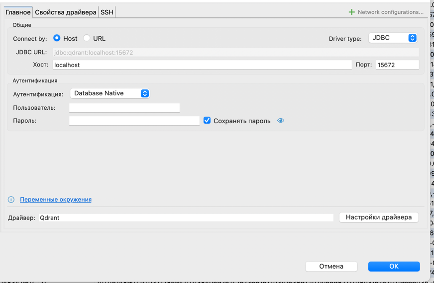
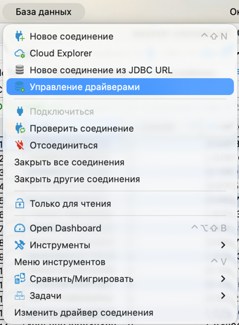
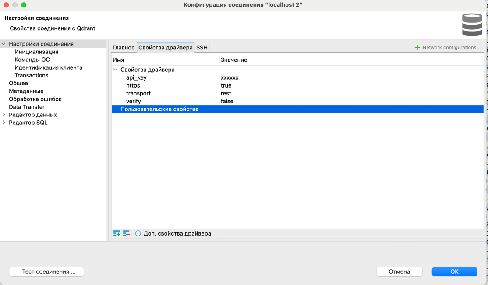
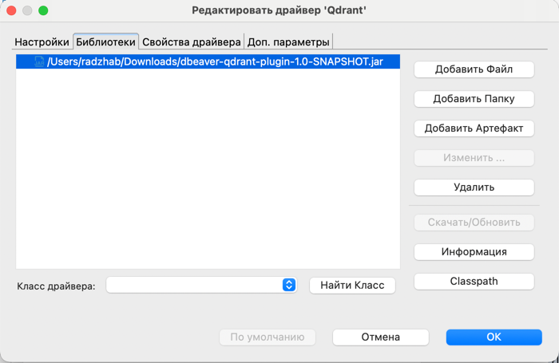
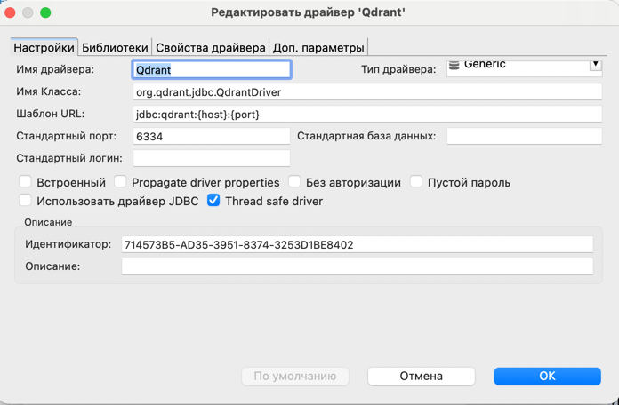

# Qdrant Driver для DBeaver

Милый маленький драйвер, чтобы открыть Qdrant в DBeaver и не страдать.

## ✨ Что он умеет

- показывает коллекции как таблицы
- открывает данные в DBeaver
- работает с `SELECT * FROM collection_name`
- ходит в Qdrant по `REST/HTTPS`
- умеет `api_key`
- умеет `verify=false` для self-signed TLS

## 💨 Самый быстрый путь

Если у тебя уже работает такой код:

```python
from qdrant_client import QdrantClient

client = QdrantClient(
    url="https://localhost:15672",
    api_key="YOUR_API_KEY",
    https=True,
    verify=False,
)
```

то в DBeaver тебе нужен вот такой конфиг:

```text
JDBC URL: jdbc:qdrant://localhost:15672

transport=rest
https=true
verify=false
api_key=YOUR_API_KEY
```

Класс драйвера:

```text
org.qdrant.jdbc.QdrantDriver
```

Вот так должен выглядеть итог:



## 🌸 Как добавить драйвер в DBeaver

### 1. Скачай jar

Лучше всего:

- открой GitHub `Releases`
- скачай последний jar

Если нужен самый свежий билд:

- открой GitHub `Actions`
- открой последний успешный прогон
- скачай `Artifact`

### 2. Открой управление драйверами

В DBeaver:

1. `Database`
2. `Управление драйверами`
3. создать новый драйвер на базе `Generic`



### 3. Заполни настройки драйвера

Поставь:

- Имя драйвера: `Qdrant`
- Имя класса: `org.qdrant.jdbc.QdrantDriver`

Можно оставить такой шаблон URL:

```text
jdbc:qdrant:{host}:{port}
```



### 4. Добавь jar

Открой вкладку `Библиотеки`.

Дальше:

1. нажми `Добавить Файл`
2. выбери скачанный jar
3. убедись, что он появился в списке библиотек



После выбора файла должно выглядеть примерно так:



### 5. Создай подключение

Используй:

```text
jdbc:qdrant://localhost:15672
```

И добавь свойства драйвера:

```text
transport=rest
https=true
verify=false
api_key=YOUR_API_KEY
```

### 6. Готово

Если всё ок:

- коллекции появятся как таблицы
- таблицы будут открываться
- `SELECT * FROM your_collection` начнёт работать

## 🍓 Готовые конфиги

### HTTPS + API key + self-signed TLS

```text
jdbc:qdrant://localhost:15672

transport=rest
https=true
verify=false
api_key=YOUR_API_KEY
```

### HTTPS + API key + нормальный сертификат

```text
jdbc:qdrant://qdrant.example.com:443

transport=rest
https=true
verify=true
api_key=YOUR_API_KEY
```

### Прямой gRPC

Только если у тебя реально открыт Qdrant gRPC:

```text
jdbc:qdrant://127.0.0.1:6334

transport=grpc
https=false
```

## 🧃 Что можно по SQL

Сейчас поддерживается:

```sql
SELECT * FROM my_collection
```

Колонки:

- `id`
- `payload`
- `vector`

Пока не поддерживается:

- `INSERT`
- `UPDATE`
- `DELETE`
- `JOIN`
- сложный SQL

## 🩹 Если сломалось

### `No subject alternative DNS name matching localhost found`

В сертификате нет `localhost`.

Решение:

- использовать hostname из сертификата
- или поставить `verify=false`

### `HTTP 404` / `UNIMPLEMENTED`

Скорее всего, драйвер пытается говорить по gRPC с REST endpoint.

Проверь:

```text
transport=rest
```

### DBeaver грузит старый драйвер

Сделай так:

1. удали старые Qdrant jars
2. добавь только новый jar
3. перезапусти DBeaver

## 🛠 Сборка

```bash
GRADLE_USER_HOME=$PWD/.gradle-local ./gradlew clean shadowJar
```

Готовый jar:

```text
build/libs/dbeaver-qdrant-plugin-1.0-SNAPSHOT.jar
```

## 🚀 Публикация

В репе настроено так:

- push в `main` => jar в GitHub Actions `Artifacts`
- push тега `v*` => GitHub `Release` с jar

Тег релиза:

```bash
git tag v0.1.0
git push origin v0.1.0
```
